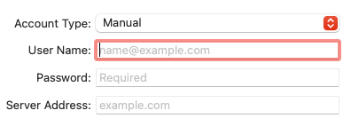
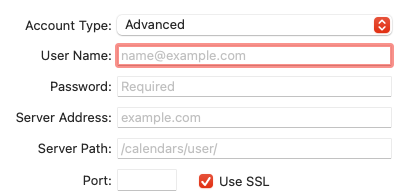

### Blix Form

## How to run this Project

```

cd into root of the project

npm i

npm start

```

**Used Technologies:**

- React version 18.2.0
- Typescript version 4.9.5
- Sass version 1.58.3
- React-hook-form version 7.43.5

**Task description:**
Dynamic fields, based on Account Type, as seen in the screenshots  
Different field types  
Placeholders text  
Data validation  
username - mandatory, [email]  
password - mandatory [dots]  
sever address [host - like you open in browser]  
server path - alphanumeric and / allowed  
port [number - range validity]  
Styling  
Submit button - validation & log JSON of payload

UI - styling should look like in the attached  
You can use open source libs, material-ui or any other libs that can help you





**Things to fix with more time**

- Fix styling to provide pixel perfect UI
- Add more validation
- Work on more clearer HTML structure
